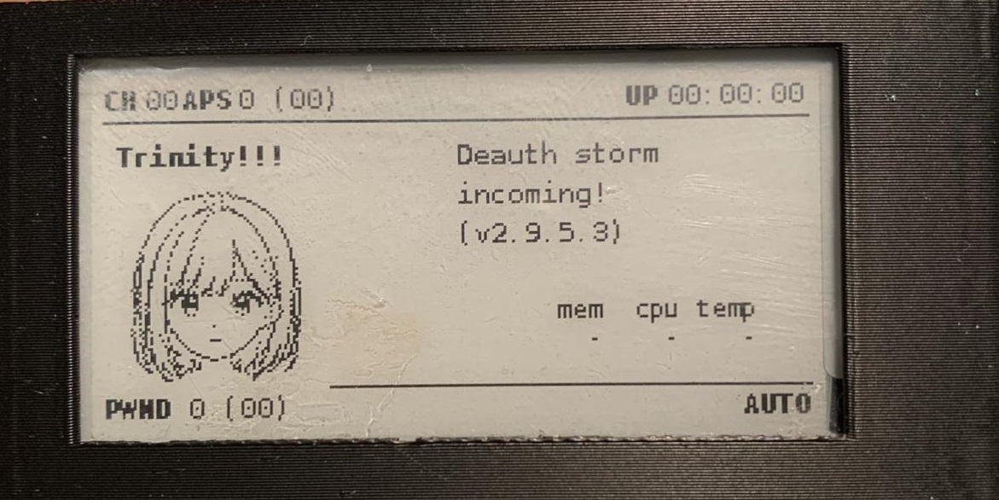
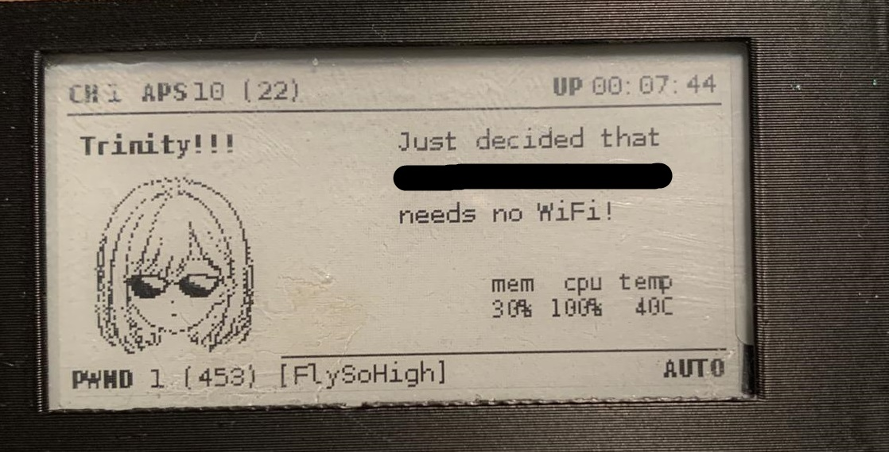

# Pwan-Girl

**Pwan-Girl** is a custom face for the [Pwnagotchi](https://pwnagotchi.ai/).

Anime-style companion for your Pwnagotchi, generated with a local AI. This mod replaces the default face female anime character.

## Preview

  
  

(The Files got updatet, so that the bottom Line doesn't get cut of like on the Preview)

## Requirements

To use this custom face, you'll need to install the custom faces mod:

🔗 [PWNAGOTCHI-CUSTOM-FACES-MOD by roodriiigooo](https://github.com/roodriiigooo/PWNAGOTCHI-CUSTOM-FACES-MOD)

For installation help, check out this tutorial:

🎥 [YouTube Installation Guide](https://www.youtube.com/watch?v=X-5jN0WjurQ)

## Voice
I made a custom voice.py for the Charakter too. 

If you managed to add the Face you will have no problem adding the Voice. 
Use FileZilla with Root access and enter /home/pi/.pwn/lib/python3.11/site-packages/pwnagotchi/voice.py
Replace the voice.py and voila!

Have Fun!
